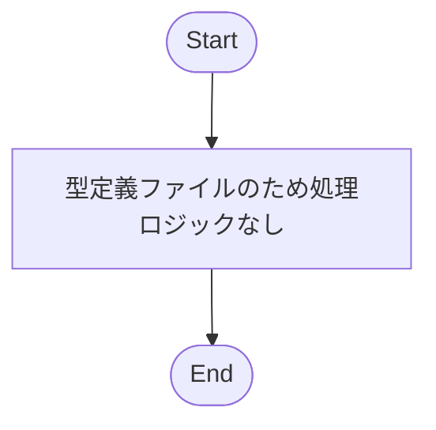
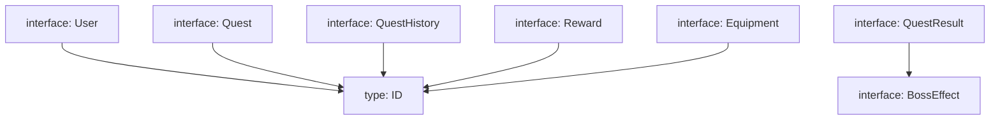

## 1. 解析メタ情報

| 項目 | 内容 |
| --- | --- |
| 対象ファイル | family-quest/src/types/index.ts |
| 言語 | TypeScript |
| 解析対象 | 提供されたコードのみ |
| 推測・補完 | 一切なし |

## 2. ファイルの概要

* アプリケーション全体で使用される共通のデータ構造（型定義、インターフェース）を定義し、提供する。
* ユーザー、クエスト、報酬、装備、ボス、インベントリ、ギルド依頼などのドメインモデルの型を網羅している。
* 根拠: [全体] (抜粋: "// 共通の型定義")

## 3. 外部依存関係

### インポート一覧

| 名称 | 種類 | 用途 | 根拠 |
| --- | --- | --- | --- |
| 該当なし | - | - | - |

### ブラックボックスとなる外部要素

| 名称 | 理由 | 根拠 |
| --- | --- | --- |
| 該当なし | 外部モジュールのインポートが存在しないため | - |

## 4. 主要要素の定義（関数 / エンドポイント / コンポーネント）

※本ファイルは型定義（Type / Interface）のみで構成されているため、各型定義を主要要素として列挙します。

### `ID`

* **役割**: IDを表す汎用的な型の定義。
* 根拠: [該当要素] (行番号: 6 / 抜粋: "export type ID = number | string;")

* **引数/リクエスト**: 該当なし
* **戻り値/レスポンス**: 該当なし
* **副作用**: なし
* **エラーハンドリング**: なし

### `User`

* **役割**: ユーザー情報のデータ構造の定義。
* 根拠: [該当要素] (行番号: 9〜21 / 抜粋: "export interface User {")

* **引数/リクエスト**: 該当なし
* **戻り値/レスポンス**: 該当なし
* **副作用**: なし
* **エラーハンドリング**: なし

### `Quest`

* **役割**: クエスト情報のデータ構造の定義。
* 根拠: [該当要素] (行番号: 24〜48 / 抜粋: "export interface Quest {")

* **引数/リクエスト**: 該当なし
* **戻り値/レスポンス**: 該当なし
* **副作用**: なし
* **エラーハンドリング**: なし

### `QuestHistory`

* **役割**: クエスト履歴のデータ構造の定義。
* 根拠: [該当要素] (行番号: 51〜62 / 抜粋: "export interface QuestHistory {")

* **引数/リクエスト**: 該当なし
* **戻り値/レスポンス**: 該当なし
* **副作用**: なし
* **エラーハンドリング**: なし

### `Reward`

* **役割**: 報酬アイテムのデータ構造の定義。
* 根拠: [該当要素] (行番号: 65〜77 / 抜粋: "export interface Reward {")

* **引数/リクエスト**: 該当なし
* **戻り値/レスポンス**: 該当なし
* **副作用**: なし
* **エラーハンドリング**: なし

### `Equipment`

* **役割**: 装備アイテムのデータ構造の定義。
* 根拠: [該当要素] (行番号: 80〜89 / 抜粋: "export interface Equipment {")

* **引数/リクエスト**: 該当なし
* **戻り値/レスポンス**: 該当なし
* **副作用**: なし
* **エラーハンドリング**: なし

### `Boss`

* **役割**: ボス情報のデータ構造の定義。
* 根拠: [該当要素] (行番号: 91〜102 / 抜粋: "export interface Boss {")

* **引数/リクエスト**: 該当なし
* **戻り値/レスポンス**: 該当なし
* **副作用**: なし
* **エラーハンドリング**: なし

### `InventoryItem`

* **役割**: インベントリアイテムのデータ構造の定義。
* 根拠: [該当要素] (行番号: 105〜114 / 抜粋: "export interface InventoryItem {")

* **引数/リクエスト**: 該当なし
* **戻り値/レスポンス**: 該当なし
* **副作用**: なし
* **エラーハンドリング**: なし

### `QuestResult`

* **役割**: APIレスポンス用のクエスト完了結果のデータ構造の定義。
* 根拠: [該当要素] (行番号: 117〜126 / 抜粋: "export interface QuestResult {")

* **引数/リクエスト**: 該当なし
* **戻り値/レスポンス**: 該当なし
* **副作用**: なし
* **エラーハンドリング**: なし

### `BossEffect`

* **役割**: ボスダメージ演出用のデータ構造の定義。
* 根拠: [該当要素] (行番号: 129〜135 / 抜粋: "export interface BossEffect {")

* **引数/リクエスト**: 該当なし
* **戻り値/レスポンス**: 該当なし
* **副作用**: なし
* **エラーハンドリング**: なし

### `FamilyMileage`

* **役割**: ファミリーマイレージのデータ構造の定義。
* 根拠: [該当要素] (行番号: 137〜142 / 抜粋: "export interface FamilyMileage {")

* **引数/リクエスト**: 該当なし
* **戻り値/レスポンス**: 該当なし
* **副作用**: なし
* **エラーハンドリング**: なし

### `Bounty`

* **役割**: ギルド依頼のデータ構造の定義。
* 根拠: [該当要素] (行番号: 145〜158 / 抜粋: "export interface Bounty {")

* **引数/リクエスト**: 該当なし
* **戻り値/レスポンス**: 該当なし
* **副作用**: なし
* **エラーハンドリング**: なし

### `PendingInventory`

* **役割**: 承認待ちインベントリアイテム用のデータ構造の定義。
* 根拠: [該当要素] (行番号: 161〜168 / 抜粋: "export interface PendingInventory {")

* **引数/リクエスト**: 該当なし
* **戻り値/レスポンス**: 該当なし
* **副作用**: なし
* **エラーハンドリング**: なし

## 5. 処理フロー図

※本ファイルは型定義のみであり、実行されるロジック（関数等）が存在しないため、処理フロー図は該当なし。

## 6. 依存関係図

型定義間の参照関係を示します。

## 7. 次のステップ（リバースエンジニアリングの提案）

| 優先度 | ファイル名(推測可) | 理由 | 根拠 |
| --- | --- | --- | --- |
| 高 | これらをインポートしているコンポーネント・API群 | 定義された各型がどのように初期化され、操作されているかの実態を把握するため。 | [全体] 型定義のみであり、利用側が存在しないと機能しないため |
| 中 | APIクライアントの実装ファイル | `QuestResult`などがAPIレスポンス用と明記されており、通信周りの処理を追う必要があるため。 | [QuestResult] (行番号: 116 / 抜粋: "// ★追加: クエスト完了結果 (APIレスポンス用)") |
| 中 | ApprovalListコンポーネント関連ファイル | `PendingInventory`の使用箇所として明記されており、承認フローの仕様を解明するため。 | [PendingInventory] (行番号: 160 / 抜粋: "// ★追加: 承認待ちインベントリアイテム用 (ApprovalListで使用)") |

## 8. 保守上の注意点

* 多くのインターフェース（`Quest`, `Reward` など）において、`description` と `desc` のように類似した意味を持つプロパティが混在しており、オプショナル（`?`）指定されています。
* `ID` 型が `number | string` のユニオン型となっているため、これらを参照する各インターフェース側のプロパティ（`id`, `quest_id`, `equipment_id` 等）を利用する際、厳密な型判定が必要になる場面が発生します。
* `Quest` インターフェースの `days` プロパティの型が `number[] | string | null` と多岐にわたり、使用箇所で複雑な型チェックやパース処理が要求される構造になっています。

## 9. 不明事項一覧

| 項目 | 理由 | 必要なファイル |
| --- | --- | --- |
| プロパティの使い分け | `Quest`の`description`と`desc`、`exp`と`exp_gain`など、類似プロパティの具体的な使われ方が不明 | 本ファイルをインポートしているコンポーネントやロジックの実装ファイル |
| DB上のデータ構造との差異 | オプショナル(`?`)が多用されているが、これがDBのNULL許容を反映しているか、フロントエンド特有の処理上の都合か不明 | バックエンドのDBスキーマ定義ファイルやAPIの実装ファイル |

## 10. 自己検証結果

* [x] 推測・外部ファイルの仕様を一切含んでいない
* [x] 全関数・全クラス・全コンポーネントを列挙した（今回は型定義を網羅）
* [x] 全てのインポート要素を列挙した（該当なし）
* [x] すべての仕様説明に「根拠（行番号・抜粋）」を明記した
* [x] 根拠漏れが0件である
* [x] Mermaid構文にエラーの原因となる記号（エスケープ漏れ）がない
* [x] 不明事項を漏れなく列挙した
完了