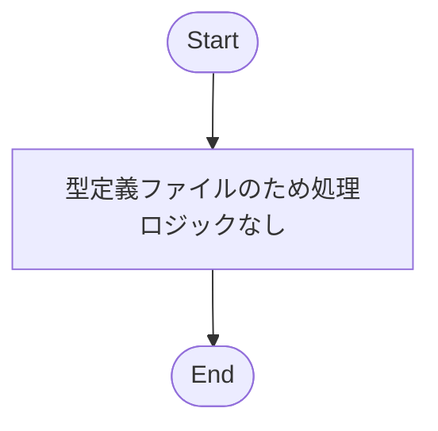
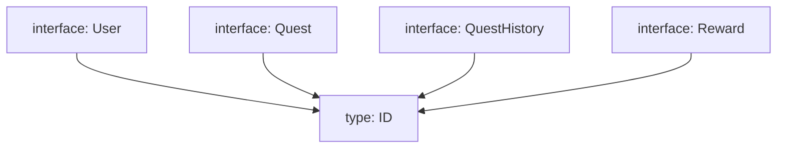

## 1. 解析メタ情報

| 項目 | 内容 |
| --- | --- |
| 対象ファイル | family-quest/src/types/index.ts |
| 言語 | TypeScript |
| 解析対象 | 提供されたコードのみ |
| 推測・補完 | 一切なし |

## 関連ドキュメント

- [useGameData.md](../hooks/useGameData.md) — `User`/`Quest`/`QuestHistory`/`Reward`/`QuestResult`型の主要な利用元。
- [apiClient.md](../lib/apiClient.md) — `InventoryItem`型の利用元。
- [useQuestStatus.md](../features/quest/hooks/useQuestStatus.md) — `User`/`Quest`/`QuestHistory`型を用いたロック・完了判定ロジックの実装元。
- [QuestList.md](../features/quest/components/QuestList.md) — `Quest`型の共有クエスト判定フィールド（`is_shared_completed_by`等）の利用元。
- [RewardList.md](../features/shop/components/RewardList.md) — `Reward`/`User`型の利用元。
- [game_logic.md](../../../MY_HOME_SYSTEM/game_logic.md) — `User.maxHp`の計算式（`calculate_max_hp(level) = level * 20 + 5`）を実装するバックエンド側のロジック実装元。
- [quest_router.md](../../../MY_HOME_SYSTEM/quest_router.md) — `Quest`の共有クエスト判定フィールドを付与するバックエンドAPIの実装元。

## 2. ファイルの概要

* アプリケーション全体で使用される共通のデータ構造（型定義、インターフェース）を定義し、提供する。
* ユーザー、クエスト、クエスト履歴、報酬、インベントリ、クエスト完了結果のドメインモデルの型を網羅している。装備・ボス・ギルド依頼・ファミリーマイレージ関連の型（`Equipment`, `Boss`, `OwnedEquipment`, `BossEffect`, `FamilyMileage`, `Bounty`）は、それらの機能自体の廃止に伴い本ファイルには存在しない。承認待ちインベントリを表す型（`PendingInventory`）も、アイテム使用時の親承認フローの廃止（2026-08-29 コミット`9d5edec`、`family-quest/CLAUDE.md`の改訂メモに記載）に伴い本ファイルには存在しない。
* 根拠: [インターフェース一覧・PendingInventoryの不在] (行番号: 1〜114 / 抜粋: 全文を確認し、`interface`/`type`の宣言は`ID`, `User`, `Quest`, `QuestHistory`, `Reward`, `InventoryItem`, `QuestResult`の7件のみで`PendingInventory`は存在しないことを確認)
* 根拠: [全体] (行番号: 3 / 抜粋: "// 共通の型定義")

## 3. 外部依存関係

### インポート一覧

| 名称 | 種類 | 用途 | 根拠 |
| --- | --- | --- | --- |
| 該当なし | - | - | - |

### ブラックボックスとなる外部要素

| 名称 | 理由 | 根拠 |
| --- | --- | --- |
| 該当なし | 外部モジュールのインポートが存在しないため | - |

## 4. 主要要素の定義（関数 / エンドポイント / コンポーネント）

※本ファイルは型定義（Type / Interface）のみで構成されているため、各型定義を主要要素として列挙します。

### `ID`

* **役割**: IDを表す汎用的な型の定義。
* 根拠: [該当要素] (行番号: 6 / 抜粋: "export type ID = number | string;")

* **引数/リクエスト**: 該当なし
* **戻り値/レスポンス**: 該当なし
* **副作用**: なし
* **エラーハンドリング**: なし

### `User`

* **役割**: ユーザー情報のデータ構造の定義。`hp`/`maxHp`はバックエンド(MY_HOME_SYSTEM)から送られてくる値であり、`maxHp`は`calculate_max_hp(level) = level * 20 + 5`で計算されるため、フロント側で独自に再計算してはならない旨がコメントで明記されている。
* 根拠: [該当要素] (行番号: 9〜26 / 抜粋: "export interface User {")

* **引数/リクエスト**: 該当なし
* **戻り値/レスポンス**: 該当なし
* **副作用**: なし
* **エラーハンドリング**: なし

### `Quest`

* **役割**: クエスト情報のデータ構造の定義。`is_shared_completed_by`等、共有クエスト判定用のフィールド（バックエンドの`get_available_quests`が付与）を含む。**（Issue #291で修正）** 以前はDBの実カラム名(`quest_id`/`exp_gain`/`gold_gain`/`icon_key`/`quest_type`/`target_user`)に加え、バックエンドが一部のみ付与していた別名(`id`/`exp`/`gold`/`icon`/`type`/`target`)も型として許容しており、どちらが実際に送られてくるか不明瞭だった。調査の結果`id`/`exp`/`gold`/`desc`は実際には一度もAPIから送られてこない「幽霊フィールド」だったと判明し、サーバー側の実カラム名のみに一本化された（`desc`はそもそも別名として型に含まれていなかったが、同種の問題として言及されている）。
* 根拠: [該当要素] (行番号: 29〜57 / 抜粋: "export interface Quest {")
* 根拠: [フィールド名統一のコメント] (行番号: 29〜34 / 抜粋: "// ★フィールド名の統一(Issue #291): 以前はDBの実カラム名(quest_id/exp_gain/\n// gold_gain/icon_key/quest_type/target_user)に加え、バックエンドが一部のみ\n// 付与していた別名(id/exp/gold/icon/type/target)も型として許容しており、\n// どちらが実際に送られてくるか不明瞭だった(id/exp/gold/descは実際には\n// 一度もAPIから送られてこない幽霊フィールドだった)。サーバー側の実カラム名に\n// 一本化し、フロントの参照側もフォールバック連鎖を廃止した。")

* **引数/リクエスト**: 該当なし
* **戻り値/レスポンス**: 該当なし
* **副作用**: なし
* **エラーハンドリング**: なし

### `QuestHistory`

* **役割**: クエスト履歴のデータ構造の定義。**（Issue #291で修正）** `quest_history.id`が実カラムであり、以前併存していた`history_id`はAPIから一度も送られてこない幽霊フィールドだったと判明したため削除された。
* 根拠: [該当要素] (行番号: 59〜75 / 抜粋: "export interface QuestHistory {")
* 根拠: [フィールド名統一のコメント] (行番号: 59〜61 / 抜粋: "// ★フィールド名の統一(Issue #291): quest_history.id が実カラムであり、\n// history_id はAPIから一度も送られてこない幽霊フィールドだったため削除した。")

* **引数/リクエスト**: 該当なし
* **戻り値/レスポンス**: 該当なし
* **副作用**: なし
* **エラーハンドリング**: なし

### `Reward`

* **役割**: 報酬アイテムのデータ構造の定義。**（Issue #291で修正）** 以前は`id`/`cost`/`icon`/`desc`が`reward_id`/`cost_gold`/`icon_key`/`description`の別名としてバックエンドが付与していたものとして型に含まれていたが、これらが幽霊フィールドだったと判明し、二重化を廃止してDBの実カラム名のみに一本化された（`cost_gold`は`cost`が任意だったのに対し必須プロパティになっている）。
* 根拠: [該当要素] (行番号: 77〜89 / 抜粋: "export interface Reward {")
* 根拠: [フィールド名統一のコメント] (行番号: 77〜80 / 抜粋: "// ★フィールド名の統一(Issue #291): id/cost/icon/desc は reward_id/cost_gold/\n// icon_key/description の別名としてバックエンドが付与していたものだが、\n// 二重化を廃止しDBの実カラム名に一本化した。")

* **引数/リクエスト**: 該当なし
* **戻り値/レスポンス**: 該当なし
* **副作用**: なし
* **エラーハンドリング**: なし

### `InventoryItem`

* **役割**: インベントリアイテムのデータ構造の定義。
* 根拠: [該当要素] (行番号: 91〜100 / 抜粋: "export interface InventoryItem {")

* **引数/リクエスト**: 該当なし
* **戻り値/レスポンス**: 該当なし
* **副作用**: なし
* **エラーハンドリング**: なし

### `QuestResult`

* **役割**: APIレスポンス用のクエスト完了結果のデータ構造の定義。`earnedMedals`はクエスト完了時に獲得したメダル枚数を表す。**（Issue #238で追加）** `partnerUserId`/`partnerLeveledUp`/`partnerNewLevel`/`partnerEarnedMedals`は、兄妹連携クエストのカスケード承認時のみ相方（自分でタップしなかった方の子ども）の情報が入るオプショナルフィールドで、連携クエストでない場合は`undefined`のまま。
* 根拠: [該当要素] (行番号: 106〜120 / 抜粋: "export interface QuestResult {")、パートナーフィールド追加 (行番号: 114〜119 / 抜粋: "// 兄妹連携クエストのカスケード承認時のみ、相方(自分でタップしなかった方の\n    // 子ども)のレベルアップ/メダル獲得情報が入る。連携クエストでない場合は無し。")

* **引数/リクエスト**: 該当なし
* **戻り値/レスポンス**: 該当なし
* **副作用**: なし
* **エラーハンドリング**: なし

## 5. 処理フロー図

※本ファイルは型定義のみであり、実行されるロジック（関数等）が存在しないため、処理フロー図は該当なし。

```mermaid
flowchart TD
    Start([Start]) --> Note["型定義ファイルのため処理ロジックなし"]
    Note --> End([End])

```

## 6. 依存関係図

型定義間の参照関係を示します。

```mermaid
graph TD
    User["interface: User"] --> ID["type: ID"]
    Quest["interface: Quest"] --> ID
    QuestHistory["interface: QuestHistory"] --> ID
    Reward["interface: Reward"] --> ID

    %% QuestResult, InventoryItem はいずれも ID 型を参照していない
    %% (id, reward_id 等は number/string に固定されている)
```

## 7. 次のステップ（リバースエンジニアリングの提案）

| 優先度 | ファイル名(推測可) | 理由 | 根拠 |
| --- | --- | --- | --- |
| 高 | これらをインポートしているコンポーネント・API群 | 定義された各型がどのように初期化され、操作されているかの実態を把握するため。 | [全体] 型定義のみであり、利用側が存在しないと機能しないため |
| 中 | APIクライアントの実装ファイル | `QuestResult`などがAPIレスポンス用と明記されており、通信周りの処理を追う必要があるため。 | [QuestResult] (行番号: 102 / 抜粋: "// ★追加: クエスト完了結果 (APIレスポンス用)") |

## 8. 保守上の注意点

* **（Issue #291で解消済み）** かつては多くのインターフェース（`Quest`, `Reward` など）において、`description` と `desc` のように類似した意味を持つ複数のプロパティ（`id`/`quest_id`、`exp`/`exp_gain`、`gold`/`gold_gain`、`icon`/`icon_key`、`type`/`quest_type`、`target`/`target_user`、`history_id`/`id`、`cost`/`cost_gold`など）が併存していたが、これらのうち`id`/`exp`/`gold`/`desc`(`Quest`)、`history_id`(`QuestHistory`)、`id`/`cost`/`desc`/`icon`(`Reward`)はバックエンドAPIから一度も送られてこない「幽霊フィールド」だったと判明し、型定義から削除された。現在はDBの実カラム名（`quest_id`/`exp_gain`/`gold_gain`/`icon_key`/`quest_type`/`target_user`/`description`/`reward_id`/`cost_gold`等）のみに一本化されている。
* `ID` 型が `number | string` のユニオン型となっているため、これらを参照する各インターフェース側のプロパティ（`id`, `quest_id` 等）を利用する際、厳密な型判定が必要になる場面が発生します。
* `Quest` インターフェースの `days` プロパティの型が `number[] | string | null` と多岐にわたり、使用箇所で複雑な型チェックやパース処理が要求される構造になっています。
* `User.maxHp` はバックエンドの `calculate_max_hp(level) = level * 20 + 5` で計算される値であり、フロントエンド側で独自に再計算してはならない旨がコメントで明記されています（過去に誤った式で再計算していた実装があったとの記述あり）。この制約はコメント上の申し合わせに過ぎず、型システムによる強制はありません。
* 根拠: (行番号: 20〜23 / 抜粋: "// バックエンド(MY_HOME_SYSTEM)から送られてくるHP。個々のプレイヤーはダメージを\n    // 受けない仕様のため hp は常に maxHp と等しいが、maxHp 自体は\n    // calculate_max_hp(level) = level * 20 + 5 で計算される値なのでフロント側で\n    // 独自に再計算してはいけない（旧実装は誤った式で再計算していた）。")
* 装備・ボス・ギルド依頼・ファミリーマイレージ関連の型（`Equipment`, `Boss`, `OwnedEquipment`, `BossEffect`, `FamilyMileage`, `Bounty`）は本ファイルには存在しない。これらの型を参照するコードが他ファイルに残存している場合はコンパイルエラーとなるため、当該機能の廃止に伴う削除漏れがないか確認が必要である。

## 9. 不明事項一覧

| 項目 | 理由 | 必要なファイル |
| --- | --- | --- |
| DB上のデータ構造との差異 | オプショナル(`?`)が多用されているが、これがDBのNULL許容を反映しているか、フロントエンド特有の処理上の都合か不明 | バックエンドのDBスキーマ定義ファイルやAPIの実装ファイル |

## 相互参照による補足情報

| 元の不明事項 | 判明した内容 | 参照元ドキュメント |
| --- | --- | --- |
| DB上のデータ構造との差異 | `quest_service.md`の解析によれば、バックエンドはユーザー情報取得時に`SELECT level, gold ...`のようなSQLクエリを実行しているとされ、DBカラム名（`level`, `gold`等）は`User`型のプロパティ名とおおむね対応しているように見える。ただしDBスキーマの型・NULL許容等の制約自体は`quest_service.md`側でも不明と記載されており、この不明事項を完全に解消するものではない。 | `../../../MY_HOME_SYSTEM/quest_service.md` |

## 10. 自己検証結果

* [x] 完了: 推測・外部ファイルの仕様を一切含んでいない
* [x] 完了: 全関数・全クラス・全コンポーネントを列挙した（今回は型定義を網羅）
* [x] 完了: 全てのインポート要素を列挙した（該当なし）
* [x] 完了: すべての仕様説明に「根拠（行番号・抜粋）」を明記した
* [x] 完了: 根拠漏れが0件である
* [x] 完了: Mermaid構文にエラーの原因となる記号（エスケープ漏れ）がない
* [x] 完了: 不明事項を漏れなく列挙した
