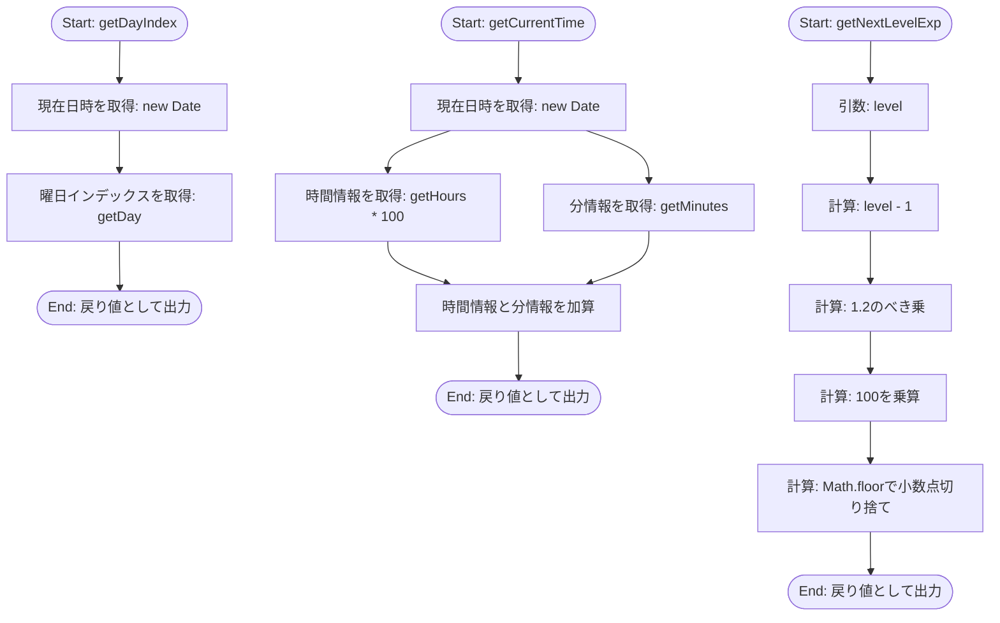
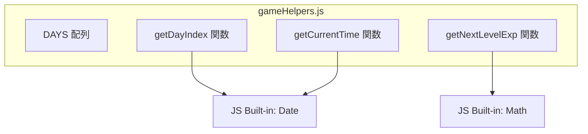

## 1. 解析メタ情報

| 項目 | 内容 |
| --- | --- |
| 対象ファイル | `gameHelpers.js` |
| 言語 | JavaScript |
| 解析対象 | 提供されたコードのみ |
| 推測・補完 | 一切なし |

## 2. ファイルの概要

* 曜日配列の提供、現在時刻の取得（曜日インデックス、HHMM形式の数値）、および指定レベルに応じた次レベルの必要経験値を計算する純粋なユーティリティ・定数群を提供する。
* 根拠: [ファイル全体] (行番号: 1〜12 / 抜粋: "export const DAYS...")

## 3. 外部依存関係

### インポート一覧

| 名称 | 種類 | 用途 | 根拠 |
| --- | --- | --- | --- |
| 該当なし | - | - | - |

### ブラックボックスとなる外部要素

| 名称 | 理由 | 根拠 |
| --- | --- | --- |
| 該当なし | - | - |

## 4. 主要要素の定義（関数 / エンドポイント / コンポーネント）

### `DAYS`

* **役割**: 日曜日から土曜日までの日本語表記の曜日文字列を格納した配列を定義する。
* 根拠: [`DAYS`] (行番号: 1〜1 / 抜粋: "export const DAYS = ['日', '月'...")

### `getDayIndex`

* **役割**: 実行環境における現在日時の曜日インデックス（0〜6）を取得する。
* 根拠: [`getDayIndex`] (行番号: 3〜3 / 抜粋: "export const getDayIndex = () ")

* **引数/リクエスト**: なし
* 根拠: [`getDayIndex`] (行番号: 3〜3 / 抜粋: "() => new Date().getDay()")

* **戻り値/レスポンス**: 数値（0が日曜、6が土曜を示すインデックス値）
* 根拠: [`getDayIndex`] (行番号: 3〜3 / 抜粋: "new Date().getDay()")

* **副作用**: なし
* 根拠: [`getDayIndex`] (行番号: 3〜3 / 抜粋: "() => new Date().getDay()")

* **エラーハンドリング**: なし
* 根拠: [`getDayIndex`] (行番号: 3〜3 / 抜粋: "() => new Date().getDay()")

### `getCurrentTime`

* **役割**: 実行環境における現在時刻を取得し、「時間×100 + 分」の計算式でHHMM形式の数値（例：午前7時45分なら745）を生成する。
* 根拠: [`getCurrentTime`] (行番号: 5〜8 / 抜粋: "return now.getHours() * 100 + ")

* **引数/リクエスト**: なし
* 根拠: [`getCurrentTime`] (行番号: 5〜5 / 抜粋: "const getCurrentTime = () => {")

* **戻り値/レスポンス**: 数値（現在時刻を数値化したもの）
* 根拠: [`getCurrentTime`] (行番号: 7〜7 / 抜粋: "return now.getHours() * 100 + ")

* **副作用**: なし
* 根拠: [`getCurrentTime`] (行番号: 5〜8 / 抜粋: "const now = new Date();")

* **エラーハンドリング**: なし
* 根拠: [`getCurrentTime`] (行番号: 5〜8 / 抜粋: "const getCurrentTime = () => {")

### `getNextLevelExp`

* **役割**: 引数として受け取ったレベルに対して、「100 × 1.2の(レベル-1)乗」の計算を行い、小数点以下を切り捨てた数値を次のレベルに必要な経験値として算出する。
* 根拠: [`getNextLevelExp`] (行番号: 10〜12 / 抜粋: "Math.floor(100 * Math.pow(1.2,")

* **引数/リクエスト**: `level`（計算に使用される数値）
* 根拠: [`getNextLevelExp`] (行番号: 10〜10 / 抜粋: "getNextLevelExp = (level) => {")

* **戻り値/レスポンス**: 数値（計算後の経験値、整数）
* 根拠: [`getNextLevelExp`] (行番号: 11〜11 / 抜粋: "return Math.floor(100 * Math.p")

* **副作用**: なし
* 根拠: [`getNextLevelExp`] (行番号: 10〜12 / 抜粋: "return Math.floor(100 * Math.p")

* **エラーハンドリング**: なし
* 根拠: [`getNextLevelExp`] (行番号: 10〜12 / 抜粋: "getNextLevelExp = (level) => {")

## 5. 処理フロー図

## 6. 依存関係図

## 7. 次のステップ（リバースエンジニアリングの提案）

| 優先度 | ファイル名(推測可) | 理由 | 根拠 |
| --- | --- | --- | --- |
| 高 | 不明（インポート先ファイル） | 提供されたコードはエクスポートのみ行っており、システム全体での使われ方（ローカル時刻の利用用途、経験値計算の呼び出し元）を把握するため。 | [`DAYS`, `getDayIndex`, `getCurrentTime`, `getNextLevelExp`] (行番号: 1, 3, 5, 10 / 抜粋: "export const ...") |

## 8. 保守上の注意点

* `getDayIndex` および `getCurrentTime` は `new Date()` を使用しているため、クライアントのローカル時刻（デバイスのシステム時刻）に依存して結果が変わる。
* 根拠: [`getDayIndex`, `getCurrentTime`] (行番号: 3, 6 / 抜粋: "new Date()")

* `getNextLevelExp` において、引数 `level` に対する型チェックや、負の値・非数値が入力された場合のバリデーション処理が存在しない。
* 根拠: [`getNextLevelExp`] (行番号: 10〜12 / 抜粋: "getNextLevelExp = (level) => {")

## 9. 不明事項一覧

| 項目 | 理由 | 必要なファイル |
| --- | --- | --- |
| 時刻・曜日情報の使用目的 | 本ファイルは時刻・曜日を返すのみであり、それがUI表示用か、ゲーム内のイベント判定用かは読み取れない。 | 本関数をインポートしているファイル |
| `level` 引数の制約 | 引数の最大値や、レベル0以下が渡されるケースが存在するかどうかは呼び出し元に依存する。 | `getNextLevelExp` を呼び出しているファイル |

## 10. 自己検証結果

* [x] 推測・外部ファイルの仕様を一切含んでいない
* [x] 全関数・全クラス・全コンポーネントを列挙した
* [x] 全てのインポート要素を列挙した
* [x] すべての仕様説明に「根拠（行番号・抜粋）」を明記した
* [x] 根拠漏れが0件である
* [x] Mermaid構文にエラーの原因となる記号（エスケープ漏れ）がない
* [x] 不明事項を漏れなく列挙した

完了